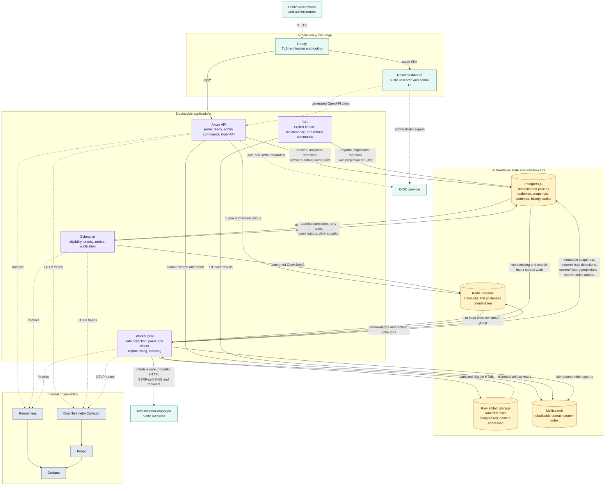

# TechAtlas

**TechAtlas is an internet technology-intelligence platform for collecting public technical signals, deriving explainable deterministic technology detections, preserving immutable history, and making the resulting corpus searchable.**

Public instance: **[https://techatlas.dpdns.org](https://techatlas.dpdns.org)**

TechAtlas is an intelligence index, not an on-demand scanner or a security-assessment service. It crawls only administrator-managed, publicly accessible targets; follows robots and configured crawl policies; and never authenticates, submits forms, bypasses access controls, or executes browser automation.

## What it provides

- **Public research:** domain and technology search; filtering by technology, category, country, recency, and confidence; comparison; and evidence-backed public analytics.
- **Explainable detections:** deterministic, versioned rules identify the initial catalogue of Next.js, Stripe, Cloudflare, PostHog, and Shopify. Every detection records confidence, method, rule version, and redacted evidence.
- **Immutable history:** successful crawls, snapshots, detections, evidence, changes, and reprocessing outputs are append-only. New collection or rule replay creates a new record rather than changing history.
- **Safe collection:** scheduler-managed crawl eligibility, priority, retries, idempotency, robots compliance, per-domain politeness, redirect and size limits, and SSRF/private-address protections.
- **Administrator operations:** authenticated users can manage the corpus, import CSV data, set crawl policy, request permitted crawls, inspect jobs and workers, retry eligible failures, manage rules, and review audits.
- **Operational visibility:** health/readiness endpoints, structured logs, Prometheus metrics, OpenTelemetry traces, Grafana dashboards, Tempo, and documented alert/incident procedures.

## Product boundaries

TechAtlas deliberately excludes browser rendering, JavaScript execution, CAPTCHA or paywall bypassing, authenticated crawling, vulnerability scanning, AI/LLM detection, public user accounts, billing, and multi-region deployment in v1. A missing signal is not evidence that a technology is absent.

Read the [canonical PRD](./TECHATLAS_PRD.md) for complete product scope and the [implementation-phase tracker](./docs/implementation-phases.md) for delivered milestones.

## Architecture

The normal crawl path is deliberately durable: the scheduler reads eligibility and refresh intent from PostgreSQL, atomically records a crawl attempt plus an outbox entry, then publishes a versioned job to Redis Streams. Workers are idempotent consumers; they acknowledge only after recording a bounded outcome, while stale stream deliveries can be reclaimed. A public refresh only advances scheduler eligibility—it never bypasses this path.

PostgreSQL is the system of record for policy, immutable collection history, detections, evidence, audit events, and projection/outbox state. Raw artifacts are stored separately after redaction. Meilisearch serves only rebuildable domain search and facets; profiles, comparisons, and analytics read PostgreSQL projections. Metrics and traces are operational consumers, not business-data stores.

| Component | Role |
| --- | --- |
| apps/api | Axum REST API, OpenAPI generation, Meilisearch-backed domain search, PostgreSQL-backed public reads, and protected admin commands. |
| apps/scheduler | Crawl eligibility, priority, scheduler-mediated refreshes, retry orchestration, durable outbox publication, and daily adoption snapshots. |
| apps/worker | Safe HTTP acquisition, DNS/TLS capture, parsing, deterministic detection, artifact persistence, historical reprocessing, and asynchronous indexing. |
| apps/cli | Explicit imports, migrations, reindexing, adoption backfills, and maintenance operations. |
| apps/dashboard | React public research interface and protected administrative UI. |
| crates | Typed domain models plus database, crawler, parser, detector, queue, storage, search, and telemetry boundaries. |

See the [monorepo architecture](./docs/architecture/monorepo.md) for ownership and dependency direction.

## Technology stack

| Area | Technology |
| --- | --- |
| Backend | Rust 1.97, Axum, SQLx, Tokio |
| Frontend | React 19, TypeScript, Vite, TanStack Router/Query, Tailwind CSS |
| Primary data | PostgreSQL 16 |
| Queue and coordination | Redis Streams |
| Search projection | Meilisearch |
| Artifact storage | Content-addressed, zstd-compressed local storage in development; pluggable storage boundary |
| Contracts | OpenAPI with a generated TypeScript API client |
| Authentication | OIDC/JWT validation for the API; Auth0 reference SPA adapter for the dashboard |
| Observability | OpenTelemetry, Prometheus, Grafana, Tempo, structured logs |
| Deployment | Docker Compose and Caddy for the initial single-host deployment |

## Prerequisites

- **Full local stack:** Docker Engine with the Compose plugin, Node.js 22, and pnpm 10. Corepack is supported.
- **Native Rust development:** the full-stack requirements plus Rust 1.97 or later; rustup stable is recommended.
- **Country enrichment:** a free MaxMind account and a GeoLite2 license key; see [GeoLite2 country enrichment](#geolite2-country-enrichment).
- **Protected admin routes:** an OIDC provider configuration. The shipped dashboard reference adapter uses Auth0; see [Authentication and authorization](#authentication-and-authorization).

## Quick start: full local stack

1. Install JavaScript dependencies and create an untracked local environment file.

   ~~~bash
   corepack enable
   pnpm install
   cp .env.example .env
   ~~~

2. Configure the OIDC values in .env before visiting an admin route. The sample values are development identifiers only; follow [authentication setup](#authentication-and-authorization).

3. Start the core application services, migrations, PostgreSQL, Redis, and Meilisearch.

   ~~~bash
   pnpm docker:up
   ~~~

4. Start the scheduler and worker when you want to collect, detect, and index data.

   ~~~bash
   COMPOSE_PROFILES=pipeline pnpm docker:up
   ~~~

5. Confirm readiness and open the dashboard.

   ~~~bash
   curl --fail http://localhost:3000/readyz
   ~~~

   - Dashboard: <http://localhost:5173>
   - API: <http://localhost:3000>
   - API liveness: <http://localhost:3000/healthz>
   - API readiness: <http://localhost:3000/readyz>
   - API metrics: <http://localhost:3000/metrics>

Use pnpm docker:logs to follow services and pnpm docker:down to stop them. Development volumes are retained when the stack stops. The Compose profile and port map are documented in [infrastructure/compose/README.md](./infrastructure/compose/README.md).

### Dashboard-only development

For UI work against an already running API:

~~~bash
pnpm dev
~~~

This starts Vite at <http://localhost:5173>. It proxies /api to http://127.0.0.1:3000 by default; set VITE_API_PROXY_TARGET to use another API endpoint.

### Run services natively

Compose is the supported way to start all dependencies. For focused backend work, start PostgreSQL, Redis, and Meilisearch first, provide the required values from [.env.example](./.env.example), and run individual processes:

~~~bash
cargo run -p techatlas-api --bin techatlas-api
cargo run -p techatlas-scheduler
WORKER_CONSUMER_NAME=worker-local-1 cargo run -p techatlas-worker
~~~

When not using Compose's migrate service, apply migrations explicitly:

~~~bash
cargo run -p techatlas-cli -- migrate-database
~~~

The API, scheduler, and worker expose /healthz and /readyz on ports 3000, 3001, and 3002 by default. The [configuration matrix](./docs/configuration.md) lists every required variable, timeout, and safe default.

## Public routes and capabilities

| Route | Capability |
| --- | --- |
| / | Product landing page with public corpus summary and discovery entry points. |
| /search and /domains | Shareable URL-backed domain search, facets, filters, sorting, and pagination. |
| /domains/:domain | Current stack, confidence/evidence, crawl metadata, changes, DNS/TLS facts, and a rate-limited refresh request. |
| /technologies and /technologies/:slug | Technology catalogue, trends, related technologies, adoption history, and observed domains. |
| /providers/:slug | Provider adoption, technology associations, and domains. |
| /compare | URL-addressable comparison of two or more domains with current/stale/unknown states. |
| /analytics | Public adoption charts, stack changes, rankings, movers, migrations, and discovery aggregates. |
| /about | Collection, evidence, safety, and interpretation methodology. |
| /admin/* | Protected corpus and operational controls. |

Public data is deliberately separated from privileged operational detail. Search uses Meilisearch; profiles, histories, comparisons, and analytics use PostgreSQL projections.

## Authentication and authorization

### Provider-agnostic API boundary

The **API does not depend on a particular identity provider or user store**. It validates standard OIDC-issued, RS256 bearer access tokens from the configured issuer, audience, and JWKS endpoint:

~~~dotenv
ADMIN_OIDC_ISSUER=https://issuer.example/
ADMIN_OIDC_AUDIENCE=https://api.example
ADMIN_OIDC_JWKS_URL=https://issuer.example/.well-known/jwks.json
~~~

Access tokens must contain a non-empty sub, match the configured issuer and audience, and include a permissions array.

| Permission | Access |
| --- | --- |
| admin:read | Read protected operational information. |
| admin:operate | Read access plus protected mutations such as imports, policy changes, crawl requests, retries, and rule operations. |

Administrator actions are rate-limited and recorded in the append-only audit log. Never send an ID token to the API; use an audience-specific access token.

### Dashboard adapter and Auth0 reference setup

The shipped dashboard uses the Auth0 React SPA adapter. Auth0 is a **reference browser integration**, not a backend requirement. To use another OIDC provider, retain the API settings and claim contract above, then replace the dashboard Auth0 adapter with that provider's SPA client. Do not weaken issuer, audience, signature, or permission checks.

For the supplied Auth0 adapter, configure:

~~~dotenv
VITE_AUTH0_DOMAIN=your-tenant.example.auth0.com
VITE_AUTH0_CLIENT_ID=your-spa-client-id
VITE_AUTH0_AUDIENCE=https://api.example
~~~

In Auth0, configure an API with the same audience, enable RBAC and **Add Permissions in the Access Token**, and assign admin:read or admin:operate to the right administrator roles. Register every dashboard callback, logout, web-origin, and CORS URL, including:

- <http://localhost:5173>
- <https://techatlas.dpdns.org>

Use HTTPS in production and make the JWKS endpoint reachable by the API. The [OIDC administrator-access runbook](./docs/runbooks/oidc-administrator-access.md) covers claim requirements and key rotation.

## GeoLite2 country enrichment

Country filtering is optional locally and required by the production worker. TechAtlas maps the **public IP address observed during a successful crawl** through a local MaxMind GeoLite2 Country MMDB. It reports server/CDN IP geolocation—not a domain owner's incorporation, office, or audience country.

Create a free MaxMind account and use its license key only for the setup command:

~~~bash
MAXMIND_LICENSE_KEY=your-license-key pnpm geoip:setup
COMPOSE_PROFILES=pipeline pnpm docker:up
~~~

The script downloads the MMDB to ignored .techatlas/geoip/ storage and writes only WORKER_GEOIP_DATABASE_PATH and WORKER_GEOIP_DATABASE_VERSION to untracked .env. It never stores or prints the license key. Do not commit the MMDB. Refresh it with the same command and restart workers; new crawls create new immutable country observations.

After enabling GeoLite2 for an existing corpus, use **Admin → Scheduler → Recrawl domains missing country data**. This action is authenticated, audited, and scheduler-mediated. See the [country-enrichment runbook](./docs/runbooks/country-enrichment.md) for detail.

## Operations and monitoring

Every API, scheduler, and worker process exposes:

- GET /healthz — process liveness.
- GET /readyz — dependency readiness; returns 503 if a required dependency is unavailable.
- GET /metrics — Prometheus metrics for internal scraping.

Run local observability with the core services:

~~~bash
OTEL_EXPORTER_OTLP_ENDPOINT=http://otel-collector:4317 \
COMPOSE_PROFILES=observability pnpm docker:up
~~~

Add pipeline to observe scheduler and worker telemetry:

~~~bash
OTEL_EXPORTER_OTLP_ENDPOINT=http://otel-collector:4317 \
COMPOSE_PROFILES=observability,pipeline pnpm docker:up
~~~

| Service | Local endpoint |
| --- | --- |
| Prometheus | <http://localhost:9090> |
| Grafana | <http://localhost:3003> |
| Tempo | <http://localhost:3200> |
| OpenTelemetry Collector (gRPC) | localhost:4317 |

Set VITE_ADMIN_OBSERVABILITY_URL to an absolute, credential-free, independently protected observability URL to expose the protected Monitoring-page link. In production Grafana and Prometheus are loopback-only; access them through an SSH tunnel or another independently authenticated administrative path. Consult the [monitoring and incident runbook](./docs/runbooks/monitoring.md) for alerts, failure simulations, and diagnosis.

## Data lifecycle and safety

- Crawls honor robots.txt, configured user-agent/contact details, per-domain politeness, redirect limits, timeouts, response-size limits, and cancellation.
- Loopback, private, link-local, multicast, unspecified, metadata-service, and DNS-rebinding targets are blocked before and after resolution and on redirects.
- Remote content is hostile input. It is bounded, parsed defensively, sanitized before rendering, and never executed.
- Raw artifacts are content-addressed, zstd-compressed, checksum verified, and redacted for credentials, tokens, cookies, authorization headers, and unnecessary personal data.
- Historical snapshots and detection/evidence records are immutable. Rule reprocessing produces separate, auditable derived records with bounded retry and dead-letter visibility.

See the [PRD](./TECHATLAS_PRD.md) and [engineering guide](./AGENTS.md) for complete safety and data-invariant requirements.

## API and generated client

The public REST API is namespaced under /api/v1/public; protected operations are under /api/v1/admin. The OpenAPI artifact is [contracts/openapi/openapi.yaml](./contracts/openapi/openapi.yaml), with generated TypeScript client output in [packages/api-client](./packages/api-client).

Do not hand-edit generated client output. After changing the API contract:

~~~bash
pnpm api:openapi
pnpm api:client:generate
pnpm api:openapi:check
pnpm api:client:check
~~~

## Quality checks

~~~bash
# JavaScript workspace
pnpm lint
pnpm typecheck
pnpm test
pnpm build
pnpm performance:check
pnpm test:e2e

# Rust workspace
pnpm cargo:fmt
pnpm cargo:lint
pnpm cargo:test
pnpm cargo:build
~~~

The browser suite runs route-level accessibility checks, visual-regression snapshots at desktop/tablet/mobile widths, and a manifest-based dashboard budget. It uses deterministic fixtures and does not call a live API. See [apps/dashboard/e2e/README.md](./apps/dashboard/e2e/README.md) before updating snapshots.

## Deployment

The supported v1 production topology is a single host running the production Compose stack behind Caddy. Caddy terminates TLS for <https://techatlas.dpdns.org>; PostgreSQL, Redis, Meilisearch, telemetry, and Grafana remain non-public.

1. Copy .env.production.example to an access-controlled file such as /etc/techatlas/production.env and set unique secrets, OIDC values, crawler user-agent/contact data, GeoLite2 path/version, and backup credentials.
2. Point TECHATLAS_PUBLIC_HOST to techatlas.dpdns.org, allow inbound TCP 80 and 443, and register the production dashboard URL with the identity provider.
3. Follow the [single-host deployment runbook](./docs/runbooks/deployment.md). The production stack runs its one-shot migration service before dependent application services start.
4. Configure S3-compatible backups and rehearse recovery using the [backup/restore runbook](./docs/runbooks/backup-restore.md).

Do not deploy the source-mounted development Compose file to production. Production migrations are forward-only; treat rollback requiring data reversal as a restore/rehearsal operation.

## Repository layout

~~~text
apps/             API, scheduler, worker, CLI, and React dashboard
crates/           Rust domain and infrastructure modules
packages/         shared UI and generated API client
contracts/        validated OpenAPI artifacts
database/         forward-only migrations and safe seeds
infrastructure/   Compose, Caddy, telemetry, and deployment configuration
docs/             architecture, ADRs, API documentation, and runbooks
tests/            cross-service tests and reusable fixtures
~~~

The Stitch design reference in stitch_techatlas_intelligence_dashboard/ informs the visual system; it is not application source.

## Contributing

Read the [engineering guide](./AGENTS.md), [canonical PRD](./TECHATLAS_PRD.md), and relevant [ADRs](./docs/adr/README.md) before opening a change. In particular:

- Keep changes within documented ownership boundaries.
- Add forward-only migrations for persisted schema changes.
- Update OpenAPI and regenerate the API client for contract changes.
- Add the smallest relevant regression coverage and run the quality checks above.
- Never add credentials, production data, MaxMind databases, or personal data to the repository.

## Documentation

- [Configuration matrix](./docs/configuration.md)
- [Runbooks](./docs/runbooks/README.md)
- [Infrastructure notes](./infrastructure/README.md)
- [CLI documentation](./docs/cli/README.md)
- [API documentation](./docs/api/README.md)
- [Examples](./examples/README.md)

## License

TechAtlas is licensed under the [MIT License](./LICENSE). Third-party dependencies and MaxMind GeoLite2 data retain their own licenses and terms.
